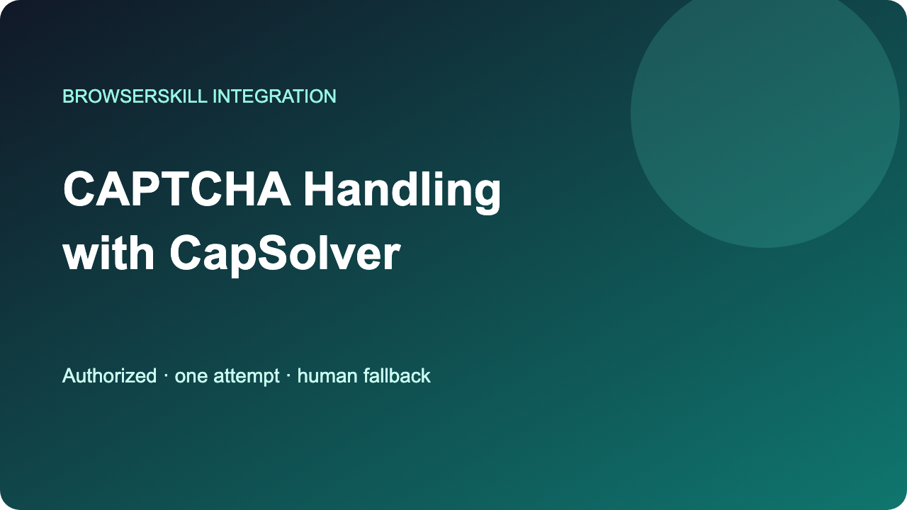

# CAPTCHA Handling for BrowserSkill with CapSolver



[](tests) [](LICENSE)

Add one bounded CAPTCHA handling decision to authorized BrowserSkill tasks while preserving its human-in-the-loop stop path.

[English](README.md) · [简体中文](docs/zh-CN/README.md) · [日本語](docs/ja/README.md) · [Español](docs/es/README.md) · [Português](docs/pt-BR/README.md) · [한국어](docs/ko/README.md)

## Introduction

When BrowserSkill runs an authorized QA or RPA task, a CAPTCHA can interrupt the browser flow and require a controlled checkpoint. This companion shows how to pass the active session, tab, goal, target, and authorization context into one bounded [CapSolver](https://www.capsolver.com/?utm_source=github&utm_medium=referral&utm_campaign=browserskill-capsolver-integration&utm_content=repository-readme) solving attempt, then resume once or return control to a person.

The project uses BrowserSkill's documented `bsk` CLI lifecycle and `request-help` fallback. It does not modify or fork BrowserSkill, implement a hidden extension hook, or claim an official partnership.

## Features

- Host allowlist, written-authorization reference, deadline, and one-attempt default.
- BrowserSkill session, tab, and task-goal context preserved in every decision.
- Optional official-API client that is off unless `CAPSOLVER_ALLOW_LIVE=1`.
- Exact `bsk request-help` argument builder and bounded outcome handling.
- Offline fixtures, nine unit tests, and a deterministic smoke test.

## How It Works

The agent detects a challenge during an authorized task and calls `ChallengeCoordinator`. Policy checks run before the gateway. A ready result is returned to target-owner-approved application code exactly once. Denial, timeout, provider error, or exhausted budget produces the documented foreground human-help command.

## Architecture

```text
bsk task → challenge event → authorization + host + budget checks
                                     ↓
                         CapSolver solving gateway
                            ↓                    ↓
                      resume once       bsk request-help → stop
```

## Quick Start

Requires Python 3.11+. Install BrowserSkill by following the official [BrowserSkill repository instructions](https://github.com/Tencent/BrowserSkill).

```bash
python -m pip install -e .
PYTHONPATH=src python -m unittest discover -s tests -v
PYTHONPATH=src python scripts/smoke_test.py
```

The tests and smoke run use fixtures and make no external requests.

## Usage

```python
from browserskill_integration import ChallengeEvent, ChallengeCoordinator, TaskContext

context = TaskContext(
    session_id="abcd",
    tab_id="tab-1",
    goal="verify an owned QA flow",
    target_url="https://qa.example.test/check",
    authorization_reference="QA-42",
    allowed_hosts=frozenset({"qa.example.test"}),
)
decision = ChallengeCoordinator(your_gateway).run(context, detected_event)
```

For live use, construct the task only from the current [CapSolver createTask contract](https://docs.capsolver.com/en/guide/api-createtask/). Poll according to the official [CapSolver getTaskResult contract](https://docs.capsolver.com/en/guide/api-gettaskresult/). Do not guess task fields or page-specific result application.

## Example Output

```text
SMOKE PASSED: authorized fixture recovered once; BrowserSkill context preserved
```

## Supported Scenarios

Owned-site QA, explicitly authorized RPA, and local integration testing with mock results. A real BrowserSkill environment and real API call were not used for this draft.

## Project Structure

- `skill/SKILL.md`: companion workflow for the documented BrowserSkill lifecycle.
- `src/browserskill_integration/`: policy, gateway, context, and human fallback helpers.
- `examples/`: fixture-based usage.
- `tests/`: offline contract and failure-path tests.
- `scripts/smoke_test.py`: deterministic end-to-end policy smoke.

## Testing

Unit tests cover success and context propagation, missing authorization, host mismatch, budget exhaustion, timeout, provider error, live-mode gating, the verified request-help arguments, and bounded human outcomes.

## Troubleshooting

If `request-help` returns `disabled`, do not retry; stop the session. After `continued` or `completed`, take one fresh snapshot. On any API error, follow the official [CapSolver API error guidance](https://docs.capsolver.com/en/guide/api-error/) and keep the attempt budget fixed.

## Responsible Use

Use only public data, systems you own, or targets with explicit written authorization. Keep a narrow hostname allowlist, a small fixed budget, reasonable rates, minimal collection, visible stop reasons, and a human fallback. Do not collect credentials, access private or restricted data, evade access controls, conceal automation, or run unbounded collection. For personal, financial, health, employment, or other sensitive data, require purpose-specific authorization, minimization, access control, audit logging, and a retention schedule; stop if any control is missing.

## Contributing

See the [contribution guidelines](CONTRIBUTING.md). Preserve the verified CLI contract, offline tests, and fail-closed defaults.

## Security

See the [security policy](SECURITY.md). Never submit keys, cookies, browser sessions, captured pages, or production task payloads.

## Conclusion

This repository is a small, auditable BrowserSkill companion: one authorized solving attempt, exact context propagation, and a documented human stop path with [CapSolver](https://www.capsolver.com/?utm_source=github&utm_medium=referral&utm_campaign=browserskill-capsolver-integration&utm_content=repository-readme).

## Maintainer Note

Developer sharing CapSolver integration examples.

## License

[MIT](LICENSE)
